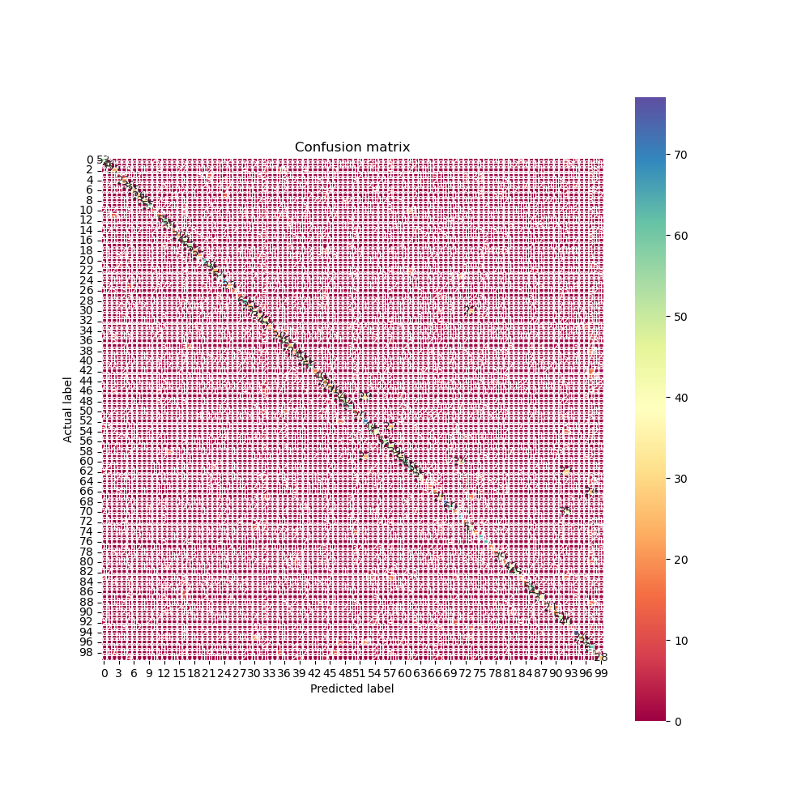

# 深度學習 作業一
A1085125 洪祐鈞(Sylvex Hung) 2023/02/24

## Disclaimer

- The code in this homework is amalgamation of LLM prompt (ChatGPT and discord Clyde), GitHub Copilot autocompletion, and random code from the forum. I would provide the prompt of the LLM to llm_prompt.md, also keep the comment for the code generated from copilot.
- I would also list some reference during my research, for the transparancy.

## Environments

- O.S: ManjaroLinux 22.1.2 Talos
- Miniconda 23.1.1
- ASUS aspire-7 (A715-51G) laptop.
- CPU: intel i7-1260p
- GPU: NVIDIA GeForce RTX 3050 4GB Laptop GPU
- Python 3.11.3
- For python module version, please refer to requirements.txt

## How to run?

Referring requirements.txt to set up your environment, preferably use a conda first so it would not messed up your local environment.

Running: ```python ex_1.py``` for first experiment, there are 5 experiments for respective experiments, it would start training and testing cifar10/cifar100 dataset for a model. Specifically, like the following:
```
if __name__ == '__main__':
    train_cifar_10()
    train_cifar_100()
```
After running any experiments, a folder named ```ex_{number}``` would be generated, which contains two folder ```cifar_10``` and ```cifar_100```, inside the folers, it would generate time-stampped folder for training/testing a single model, inside the timestampped folder, contains the important files as follows:

- train.json: training log
- test.json: test log
- loss.png: loss per epoch during training
- accuracy.png: train/validation accuracy during training
- confusion_matrix.png: as the name shows.
- best.pth: the best model best validation accuracy during training.
- epoch-{num}: model file for checkpoint.

The log contains training/testing complete time, accuracy/loss per epoch during training, test metrics(accuracy, ioc score, precision, F1_score, and etc.) I would do a comparison at comparision, if you want to see more fine-grained version, you can check that out!
(tips: use json formater can help you see the log if your ide has one.)

Also it would also generate data for cache-ing the cifar10/cifar100 datasets.

## General Strategy of the homework

- The computational resources is limited, instead of choosing a bulky model which has highest accuracy. What I care about is the efficiency of the model, which means I can get high accuracy in short amount of time. This way, I can have more feedback 
- Running on local computer, which I can modularize my code and having better developter experience. ~~Also, I love copilot.~~
- Keeping the training/testing log, and visualize the result. For better knowing what exactly happened during training and testing.
- Crammming as much of the batch size as my GPU can handle.

## Experiments

### EX-1

Basically, the model is the same as what the professor gave us. What's different is the batch size is 128, and the number of epoch is 50.

Here's Cifar 10 results:


```
# Training:
"best_val_accuracy": 71.94%,
"best_epoch": 13,
"train_time": 124.0 seconds
```

```
# Testing:
"accuracy": 72.24%,
"losses": 0.8672,
"testing time": 0.4442 seconds,
"precision_score": 0.7325,
"recall_score": 0.7224,
"f1_score": 0.7255,
"auc_score": 0.8458,
```

Here's Cifar 100 results:




```
# Training: 
"best_val_accuracy": 35.25%,
"best_epoch": 6,
"train_time": 127.2 seconds
```

```
# Testing
"accuracy": 34.65%, 
"losses": 2.6727387393951414,
"testing time": 0.486 seconds,
"precision_score": 0.374,
"recall_score": 0.3465,
"f1_score": 0.3389,
"auc_score": 0.6699,
```

As the result shows, it have overfitting problem. Especially cifar100. Since the validation loss goes sky-rocket. My speculation of why cifar100 has massive overfitting may due to:

1. The image number per class is small, which provide the same information over and over again.
2. The image size is too small, provide little information for a model to learn.
3. The model is too small, which can not extract too much feature.

In this experiment, this is the first time I learned that what is overfitting, and longer training epoch is not the fix.

Also, fun fact: I literally ask LLM what metrics should I include in the report, and the metrics above is what it gave me, and I learned what these new metrics means on the fly. Due to the test set number of class is identical for all the classes. the recall score and the accuracy should be the same. This surprise me the first.

## Mistake I've made

- Validation and train Set contains duplicate image, which cause the validation accuracy goes insanely high. Showing the inaccurate metrics.
- Not reading the documentation or overly rely on the prompt that AI gives me. Sometimes if you just scraping the curface, it's easy to make stupid mistakes that would cost you like 2 days.
- Using WSL as my first development, which turns out running on linux natively would be signigicantly faster. It seems like even on WSL, it still use CUDA that embedds in windows. And it makes anything related to data transform significantly slower.
- Procrastination. I could've try more thing, or doing more ablation study.

## Things I can improve or try

- Using Kaggle and utilizing the distributed training for getting faster result. (But modularizing the code seems a bit of a pain)
- ~~Using the lab GPU without any permission, for my own greed.~~
- Doing more ablation study. I tend to doing things on the fly and forget what exactly I was aiming for.
- Using tensorboard for realtime visualization. (It feels bad after I'd done the visualizing part and then seeing this.)

## Final Thoughts

For me, implementation plays huge parts for my learning habits. If I cannot implement what I've learned, then I mostly may have not have that level of understanding of the domain knowledge.
