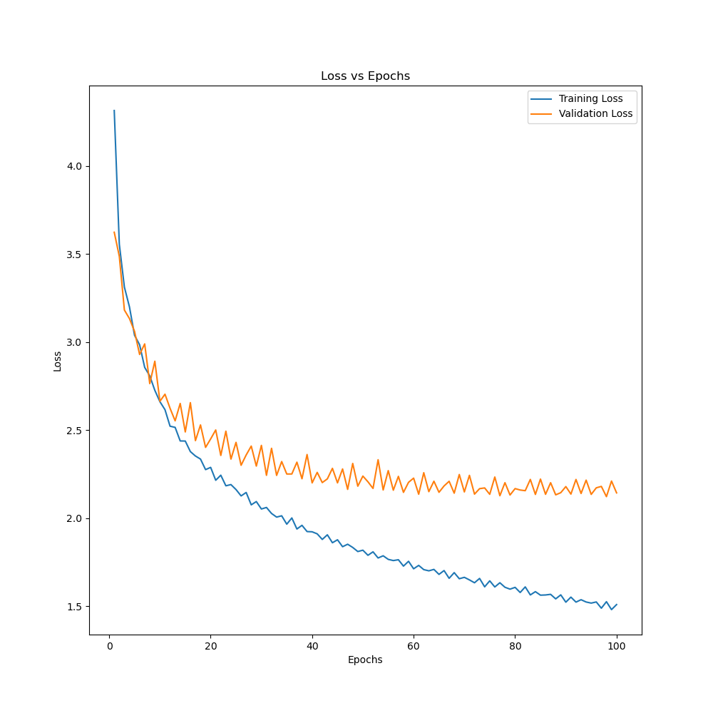

# 深度學習 作業一

A1085125 洪祐鈞 (Sylvex Hung) 
2023/02/24

## Disclaimer

- The code in this homework is amalgamation of LLM prompt (ChatGPT and discord Clyde), GitHub Copilot autocompletion, and random code from the forum. I would provide the prompt of the LLM to llm_prompt.md, also keep the comment for the code generated from copilot.
- All the experiment are done on local computer, and the parameters for performance (e.x. dataloader num_workers) is massively depends on my own laptop. You may modify yourself to make it smoother on your computer. 

## Environments

- O.S: ManjaroLinux 22.1.2 Talos
- Miniconda 23.1.1
- ASUS aspire-7 (A715-51G) laptop.
- CPU: intel i7-1260p
- GPU: NVIDIA GeForce RTX 3050 4GB Laptop GPU
- Python 3.11.3
- For python module version, please refer to requirements.txt

## How to run?

Referring requirements.txt to set up your environment, preferably use a conda environment first so it would not messed up your local environment.

Running: ```python ex_1.py``` for first experiment, there are 5 experiments for respective experiments, it would start training and testing cifar10/cifar100 dataset for a model. Specifically, like the following:

```
if __name__ == '__main__':
    train_cifar_10()
    train_cifar_100()
```

After running any experiments, a folder named ```ex_{number}``` would be generated, which contains two folder ```cifar_10``` and ```cifar_100```, inside the folers, it would generate time-stampped folder for training/testing a single model, inside the timestampped folder, contains the important files as follows:

- train.json: training log
- test.json: test log

     The json files are also used to generate visualization image!

- loss.png: loss per epoch during training
- accuracy.png: train/validation accuracy during training
- confusion_matrix.png: as the name shows.
- best.pth: the best model best validation accuracy during training.
- epoch-```num```: model file for checkpoint.

The log contains training/testing complete time, accuracy/loss per epoch during training, test metrics (accuracy, ioc score, precision, F1_score, and etc.) I would do a comparison at comparision, if you want to see more fine-grained version, you can check that out!

Also it would also generate data for cache-ing the cifar10/cifar100 datasets.

## General Strategy of the homework

- The computational resources is limited, instead of choosing a bulky model which has highest accuracy. What I care about is the efficiency of the model, which means I can get high accuracy in short amount of time. This way, I can have more feedback to fix things earlier and making more prototypes.
- Running on local computer, which I can modularize my code and having better developter experience. ~~Also, I love copilot.~~
- Keeping the training/testing log, and visualize the result. For better knowing what exactly happened during training and testing.
- Cramming as much of the batch size as my GPU can handle to increase the training speed.

## Experiments

### EX-1

Basically, the model is the same as what the professor gave us. What's different is the batch size is 128, and the number of epoch is 50.

The model architecture is as follows: (num_classes = 100 for cifar100)

```
----------------------------------------------------------------
        Layer (type)               Output Shape         Param #
================================================================
            Conv2d-1           [-1, 12, 30, 30]             912
       BatchNorm2d-2           [-1, 12, 30, 30]              24
            Conv2d-3           [-1, 12, 28, 28]           3,612
       BatchNorm2d-4           [-1, 12, 28, 28]              24
         MaxPool2d-5           [-1, 12, 14, 14]               0
            Conv2d-6           [-1, 24, 12, 12]           7,224
       BatchNorm2d-7           [-1, 24, 12, 12]              48
            Conv2d-8           [-1, 24, 10, 10]          14,424
       BatchNorm2d-9           [-1, 24, 10, 10]              48
           Linear-10                  [-1, 100]         240,100
================================================================
Total params: 266,416
Trainable params: 266,416
Non-trainable params: 0
----------------------------------------------------------------
Input size (MB): 0.01
Forward/backward pass size (MB): 0.42
Params size (MB): 1.02
Estimated Total Size (MB): 1.44
----------------------------------------------------------------
```

Here's Cifar 10 results:


```
# Training:
"best_val_accuracy": 71.94%,
"best_epoch": 13,
"train_time": 124.0 seconds
```

```
# Testing:
"accuracy": 72.24%,
"losses": 0.8672,
"testing time": 0.4442 seconds,
"precision_score": 0.7325,
"recall_score": 0.7224,
"f1_score": 0.7255,
"auc_score": 0.8458,
```

Here's Cifar 100 results:

  

  

```
# Training: 
"best_val_accuracy": 35.25%,
"best_epoch": 6,
"train_time": 127.2 seconds
```

```
# Testing
"accuracy": 34.65%, 
"losses": 2.6727387393951414,
"testing time": 0.486 seconds,
"precision_score": 0.374,
"recall_score": 0.3465,
"f1_score": 0.3389,
"auc_score": 0.6699,
```

As the result shows, it have overfitting problem. Especially cifar100. Since the validation loss goes sky-rocket. My speculation of why cifar100 has massive overfitting may due to:

1. The image number per class is small, which provide the same information over and over again.
2. The image size is too small, provide little information for a model to learn.
3. The model is too small, which can not extract too much feature.

In this experiment, this is the first time I learned that what is overfitting, and longer training epoch is not the fix.

Also, fun fact: I literally ask LLM what metrics should I include in the report, and the metrics above is what it gave me, and I learned what these new metrics means on the fly. Due to the test set number of class is identical for all the classes. the recall score and the accuracy should be the same. This surprise me the first.

### EX-2

For the spculation above, I think it's good to add some changes accordingly:

1. Augmenting the number of class samples.
2. Resizing the image to larger size.
3. Making the model larger to extract more features.

Simply words: Bigger, better and stronger.

#### Model design

So I make the model as following:

```
----------------------------------------------------------------
        Layer (type)               Output Shape         Param #
================================================================
            Conv2d-1         [-1, 16, 128, 128]             448
       BatchNorm2d-2         [-1, 16, 128, 128]              32
              ReLU-3         [-1, 16, 128, 128]               0
         MaxPool2d-4           [-1, 16, 64, 64]               0
            Conv2d-5           [-1, 32, 64, 64]           4,640
       BatchNorm2d-6           [-1, 32, 64, 64]              64
              ReLU-7           [-1, 32, 64, 64]               0
         MaxPool2d-8           [-1, 32, 32, 32]               0
            Conv2d-9           [-1, 64, 32, 32]          18,496
      BatchNorm2d-10           [-1, 64, 32, 32]             128
             ReLU-11           [-1, 64, 32, 32]               0
        MaxPool2d-12           [-1, 64, 16, 16]               0
           Linear-13                 [-1, 1024]      16,778,240
             ReLU-14                 [-1, 1024]               0
           Linear-15                  [-1, 100]         102,500
================================================================
Total params: 16,904,548
Trainable params: 16,904,548
Non-trainable params: 0
----------------------------------------------------------------
Input size (MB): 0.19
Forward/backward pass size (MB): 11.39
Params size (MB): 64.49
Estimated Total Size (MB): 76.06
----------------------------------------------------------------
```

Specifically:

- Input: ```3*128*128```
- 3 convolution layer are all ```kernel_size=3, stride=1, padding=1```
- 3 max pooling layers are all ```kernel_size=2, stride=2```.
- 2 linear layers: with 1024 and 10/100 output (cifar10/cifar100)
- Activation function are all ReLU

The reason behind my design was:

- In the VGG model paper, it states that using smaller size convolution can increase the receptive field.
- Using size (3,1,1) convolution layer and (2,2) max pooling layer is just easier to design and calculate the layer output.
- Multiple linear layers seems perform better than single layer.
- With the consideration of training time, and increase the size of the image, I'm afraid of increasing the depth of the network.

#### Data augmentation

For the data augmentation part, basically I'm refer to the artical:
[(Image Classification — Cifar100)](https://shihyung1221.medium.com/image-classification-cifar100-af751271b398): The author resize to image larger to get better result. Hence, I do the following for the augmentation:

```
transforms.Resize((128, 128), antialias=True),
transforms.RandomCrop(128, padding=16),
transforms.RandomHorizontalFlip(),
```

The way I didn't do too much transformation has several reasons:
- I was trying training on WSL and kaggle, transformation cause massive bottleneck during training. The GPU did random spike with low utilization on WSL. For kaggle, it overloads the CPU. (Although I did re-train on native linux and the performance is a lot better)
- This project [kuangliu /
pytorch-cifar](https://github.com/kuangliu/pytorch-cifar/blob/master/main.py) only use the transformation above to achieve over 90% accuracy on cifar 10.

Hence with the resize preprocess, augmentation transformation, and larger CNN networks:

Parameter: (lr=0.001, weight_decay=0.0001, epoch=50, also optimizer switch to AdamW)

Here's cifar10 results:

  

  

  

```
# Training:
"best_val_accuracy": 75.51%,
"best_epoch": 48,
"train_time": 1119 seconds
```

``` Testing:
"accuracy": 75.16%,
"losses": 1.166,
"testing time": 2.501,
"precision_score": 0.7529,
"recall_score": 0.7516,
"f1_score": 0.7509,
"auc_score": 0.8620,
```

Here's cifar100 results:

  


```
# Training:
"best_val_accuracy": 39.96%,
"best_epoch": 19,
"train_time": 1137 seconds
```

```
# Testing:
"accuracy": 41.62%,
"losses": 2.564,
"testing time": 2.502 seconds,
"precision_score": 0.4273,
"recall_score": 0.4162,
"f1_score": 0.4139,
"auc_score": 0.7052,
```

As the result shows, I get ```(+3%/+7%)``` (cifar10/cifar100) accuracy improvement compares to ex_1 by doing this. But the model still has overfitting problem, further trainging would not help at all.

### Learning rate scheduling:

Hence, new techniques introduces: learning rate scheduling:

From this [【Day20】Pytorch Learning Rate Scheduler](https://ithelp.ithome.com.tw/m/articles/10298468), It states that it can reduce the training time and help the convergence of the training, so I think it's good to give it a shot.

Here's cifar10 results:

  


  


```
# Training
"best_val_accuracy": 76.05%,
"best_epoch": 49,
"train_time": 1133 seconds
```

```
# Testing
"accuracy": 0.7857,
"losses": 0.6352,
"testing time": 2.744 seconds,
"precision_score": 0.7866,
"recall_score": 0.7857,
"f1_score": 0.7851,
"auc_score": 0.8809,
```

Here's cifar100 results:


```
# Training
"best_val_accuracy": 42.86%,
"best_epoch": 44,
"train_time": 1148 seconds
```

```
# Testing
"accuracy": 46.11%,
"losses": 2.106,
"testing time": 2.563,
"precision_score": 0.4652,
"recall_score": 0.4611,
"f1_score": 0.4570,
"auc_score": 0.7278,
```

From the loss and accuracy, it shows that the overfitting problem is reduced, squeeze out ```(+3%/+5%)``` accuracy,  and it seems we can train futher without much hesitation.

~~Edit: Arguably the learning rate was too large or weight decay too small? should've done more ablation study but I'm lazy and running out of time~~

Now changing the epoch from 50 to 100:

Here's the cifar10 result:

  

  


```
# Training:
"best_val_accuracy": 77.21%,
"best_epoch": 100,
"train_time": 2287 seconds
```
```
"accuracy": 79.12%,
"losses": 0.6183,
"testing time": 2.595,
"precision_score": 0.7900,
"recall_score": 0.7912,
"f1_score": 0.7905,
"auc_score": 0.884,
```

Here's cifar100 result:

  

  

```
# Training:
"best_val_accuracy": 46.4%,
"best_epoch": 88,
"train_time": 2281 seconds
```

```
# Testing:
"accuracy": 48.84%,
"losses": 2.061,
"testing time": 2.478,
"precision_score": 0.4878,
"recall_score": 0.4884,
"f1_score": 0.4842,
"auc_score": 0.7416,
```

Increasing from 50 epochs to 100 epochs squeeze out ```(+0.5%/+2%)``` accuracy more. To be honest, from the validation loss, I think we can add more epochs. But It would still hit the limit that doesn't meet up my expectation. My expectation is cifar100 should have at least 80% accuracy.

Here's the comparison so far:

> cifar10:

| Experiment | Accuracy | Training time | Testing tine |
| - | - | - | - |
| EX-1 | 72.24% | 124 seconds | 0.444 seconds |
| EX-2 | 79.12% | 2287 seconds | 2.595 seconds |

> cifar 100

| Experiment | Accuracy | Training time | Testing tine |
| - | - | - | - |
| EX-1 | 34.65% | 127 seconds | 0.486 seconds |
| EX-2 | 48.84% | 2281 seconds | 2.478 seconds |

Also larger model introduce more inference time I guess.

### EX-3

> Issac Newton: If I have seen further than others, it is by standing upon the shoulders of giants.

Instead of doing everything from scratch, why not just build from existing solution? 

#### Transfer learning

My main goal of choosing of the model is to get the highest accuracy in short amount of time on limited computertational resource. Hence I choose efficientnetv2 as a starting point to do transfer learning.

Model info: 

```
# efficientnet_v2_s

Total params: 21,458,488
Trainable params: 21,458,488
Non-trainable params: 0
----------------------------------------------------------------
Input size (MB): 0.01
Forward/backward pass size (MB): 7.38
Params size (MB): 81.86
Estimated Total Size (MB): 89.25
```

I'm not complete sure why we don't need to modify the input and output layer to get the result. It seems like the network utilize the compound scaling mechanism under the hood.

Here, I feed the model ```32*32``` image directly to the model, without resizing, data augmentation and learning rate scheduling. 

(Parameters: Adam optimizer, lr=0.0001, weight_decay=0.0001, epoch = 40)

During the transfer learning, it seems the learning rate shouldn't be too high, so I set the learning rate to 1/10 as the original.

Here's cifar 10 result:

  

  

  

```
# Training:

"best_val_accuracy": 86.39%,
"best_epoch": 39,
"train_time": 1835 seconds
```

```
# Testing: 
"accuracy": 86.00%,
"losses": 0.6456,
"testing time": 3.552 seconds,
"precision_score": 0.8633,
"recall_score": 0.8600,
"f1_score": 0.8608,
"auc_score": 0.9222,
```

Here's cifar100 result:

  


```
# Training

"best_val_accuracy": 60.74%,
"best_epoch": 40,
"train_time": 1838 seconds
```

```
# Testing

"accuracy": 61.2%,
"losses": 2.277,
"testing time": 3.560,
"precision_score": 0.6193,
"recall_score": 0.612,
"f1_score": 0.6130,
"auc_score": 0.8040,
```

We can clearly see that the cifar100 do have overfit problem. It might worth to do what we did in ex_2 to improve our result.

Comparison so far:

> cifar10:

| Experiment | Accuracy | Training time | Testing tine |
| - | - | - | - |
| EX-1 | 72.24% | 124 seconds | 0.444 seconds |
| EX-2 | 79.12% | 2287 seconds | 2.595 seconds |
| EX-3 | 86.00% | 1835 seconds | 3.552 seconds |

> cifar 100

| Experiment | Accuracy | Training time | Testing tine |
| - | - | - | - |
| EX-1 | 34.65% | 127 seconds | 0.486 seconds |
| EX-2 | 48.84% | 2281 seconds | 2.478 seconds |
| EX-3 | 61.20% | 1838 seconds | 3.560 seconds |

For this, we can see massive improvement using the transfer learning and better model. But how much can improve from now on?

### EX-4

#### Playing the same old trick

Here, we did the same as ex_2 did. Adding learning rate scheduler, image resizing and data augmentation.

(Parameters: Adam optimizer, lr=0.0001, weight_decay=0.0001, epoch = 15)

Here's cifar10 result: 


  

  

```
# Training:

"best_val_accuracy": 96.5%,
"best_epoch": 12,
"train_time": 2906 seconds
```

```
# Testing:

"accuracy": 96.24%,
"losses": 0.1624,
"testing time": 13.37 seconds,
"precision_score": 0.9624,
"recall_score": 0.9624,
"f1_score": 0.9624,
"auc_score": 0.9791,

```

Here's cifar100 result: 

  


```
# Training:
"best_val_accuracy": 84.54%,
"best_epoch": 10,
"train_time": 2912 seconds
```

```
# Testing:
"accuracy": 83.8%,
"losses": 0.806,
"testing time": 13.43 seconds,
"precision_score": 0.8404,
"recall_score": 0.838,
"f1_score": 0.8375,
"auc_score": 0.9182,

```

Here's the comparison so far:

> cifar10:

| Experiment | Accuracy | Training time | Testing tine |
| - | - | - | - |
| EX-1 | 72.24% | 124 seconds | 0.444 seconds |
| EX-2 | 79.12% | 2287 seconds | 2.595 seconds |
| EX-3 | 86.00% | 1835 seconds | 3.552 seconds |
| EX-4 | 96.50% | 2906 seconds | 13.37 seconds |

> cifar 100

| Experiment | Accuracy | Training time | Testing tine |
| - | - | - | - |
| EX-1 | 34.65% | 127 seconds | 0.486 seconds |
| EX-2 | 48.84% | 2281 seconds | 2.478 seconds |
| EX-3 | 61.20% | 1838 seconds | 3.560 seconds |
| EX-4 | 83.80% | 2912 seconds | 13.43 seconds |

From the comparison, we can see that apply data augmentation, image resizing and learning rate scheduling. We cam massively improve the accuracy, while it make the cifar100 to hit over 0.9 auc score, too. Also, larger image for the same model would increase the inference time in testing.

### EX-5

Basically on paper with code website, I saw the highest ImageNet accuracy using Lion optimizer. Hoping to squeeze out more accuracy extending from ex-4, but I cannot surpass the current accuracy even train twice epoches as ex-4 does. Maybe blindly using the state-of-the-art technology may no always work.

ref: [Symbolic Discovery of Optimization Algorithms ](https://paperswithcode.com/paper/symbolic-discovery-of-optimization-algorithms)

Here's cifar10 result:

  

  


```
# Training:
"best_val_accuracy": 96.68%,
"best_epoch": 20,
"train_time": 5846 seconds
```

```
# Testing:
"accuracy": 96.14%,
"losses": 0.1695,
"testing time": 13.27 seconds,
"precision_score": 0.9615,
"recall_score": 0.9614,
"f1_score": 0.9614,
"auc_score": 0.9786,
```

Here's cifar100 result:

  

  

```
# Training:
"best_val_accuracy": 83.33,
"best_epoch": 23,
"train_time": 5836 seconds
```

```
# Testing
"accuracy": 0.8307,
"losses": 0.9209934959411621,
"testing time": 13.394379615783691,
"precision_score": 0.8358766340629521,
"recall_score": 0.8306999999999998,
"f1_score": 0.8310803421424419,
"auc_score": 0.9144949494949496,
```

Here's the comparison so far:

> cifar10:

| Experiment | Accuracy | Training time | Testing tine |
| - | - | - | - |
| EX-1 | 72.24% | 124 seconds | 0.444 seconds |
| EX-2 | 79.12% | 2287 seconds | 2.595 seconds |
| EX-3 | 86.00% | 1835 seconds | 3.552 seconds |
| EX-4 | 96.24% | 2906 seconds | 13.37 seconds |
| EX-5 | 96.14% | 5846 seconds | 13.27 seconds |

> cifar 100

| Experiment | Accuracy | Training time | Testing tine |
| - | - | - | - |
| EX-1 | 34.65% | 127 seconds | 0.486 seconds |
| EX-2 | 48.84% | 2281 seconds | 2.478 seconds |
| EX-3 | 61.20% | 1838 seconds | 3.560 seconds |
| EX-4 | 83.80% | 2912 seconds | 13.43 seconds |
| EX-5 | 83.33% | 5836 seconds | 13.39 seconds |

## Conclusion:

Here's few things to conclude all the experiment:
1. Larger model can improve the accuracy, but these's still some limit.
2. Data augmentation, resizing the image bigger can improve the accuracy. Especially if the sample size is small.
3. Scheduling the learning rate can help to train the model a lot, usually it can lead to better result. Practically speaking, it feels more tolerant to train a model, since aside from the model and data preprocessing, learning rate feels the biggest factor of the accuracy result.
4. Using the state-of-the-art-technology may not always works better.

## Mistake I've made

- Validation and train Set contains duplicate image, which cause the validation accuracy goes insanely high. Showing the inaccurate metrics.
- Appending the training set copy and thinks that it's part of the data augmentation: During the training, it's kind of a sampling process, so it won't work.
- Not reading the documentation or overly rely on the prompt that AI gives me. Sometimes if you just scraping the curface, it's easy to make stupid mistakes that would cost you like 2 days.
- Using WSL as my first development, which turns out running on linux natively would be signigicantly faster. It seems like even on WSL, it still use CUDA that embedds in windows. And it makes anything related to data transform significantly slower.
- Falling into the rabbit hole of browsing instead of actually do stuff.
- Procrastination. I could've try more thing, or doing more ablation study. While it's actually give me more time to think and have more ideas on this project.

## Things I can improve or try

- Trying test-time-validation (TTL), it's seems like this technique can also squeeze out some accuracy. However, it's harder to implement or harder to understand for me.
- Read and save the model config to have more fined-grained experiment management, there's too much thing done on-the-fly and not present in this report.
- Learning how efficientnetv2 work, it's still a interesting topic for me.
- Trying training efficientnetv2 without pretrained model, while I'm about to end the homework and now I think I should've done this.
- Trying variety of learning rate scheulers.
- Using Kaggle and utilizing the distributed training for getting faster result. (But modularizing the code seems a bit of a pain)
- ~~Steal the lab GPU without any permission, for my own greed.~~
- Doing more ablation study. I tend to doing things on the fly and forget what exactly I was aiming for.
- Using tensorboard for realtime visualization. (It feels bad after I'd done the visualizing part and then seeing this.). Or trying out more framework. It seems like fast.ai has dominate the kaggle competition for quite some time.

## Final Thoughts

For me, implementation plays huge parts for my learning habits. If I cannot implement what I've learned, then I mostly may have not have that level of understanding of the domain knowledge. While implementing these kind of project, I constantly searching on the Internet and use various tools to learn a lot of stuff on the fly. Also sorry for the late submission of the homework, recently there's too much things going on my life while I was trying to complete my report. I'm still trying to find a balance in my life.  